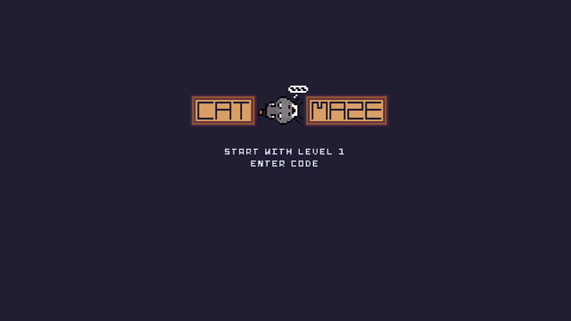
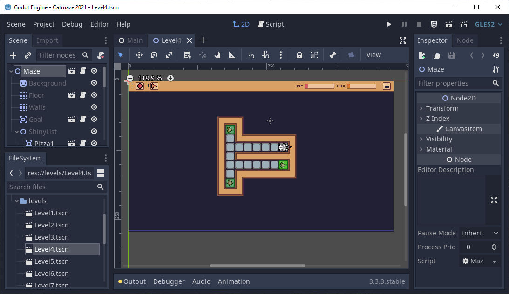

# Catmaze

Catmaze is a puzzle game. To win, the player must lure the cat through different
mazes using either toys or food.

My goal was to write a simple game (400 LOC) that can be used as a resource to 
learn game programming using [Godot](https://godotengine.org/).

The game can be played [online](https://pinky39.github.io/catmaze/).

## For developers

To modify the game you will need [Godot 3](https://godotengine.org/).

### Adding new levels
New levels can be added without programming using the level editor. They must 
be named `Level[level-number].tscn`. 

